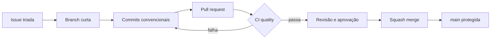

# BenchFlow

Benchmark didático de GitFlow com um CRUD Python, testes automatizados, cobertura mínima, templates de colaboração e proteção da branch principal.

## O que este repositório demonstra

- três formulários de issue: **bug**, **feature** e **pedido**;
- três exemplos preenchidos de issues e três de pull requests;
- API CRUD de tarefas com FastAPI;
- testes automatizados com `pytest` e cobertura mínima de 95%;
- lint com Ruff;
- GitHub Actions executado em todo PR para `main` ou `develop`, validando código e packages;
- `main` protegida por PR, conversas resolvidas e check `quality` aprovado, com bypass disponível para administradores;
- dependências monitoradas pelo Dependabot e ownership via CODEOWNERS.
- releases semânticas com notas pré-preenchidas, artifacts verificáveis e imagem no GHCR.

## Executar o projeto

Requisitos: Python 3.11+ e [uv](https://docs.astral.sh/uv/).

```bash
uv sync --dev
uv run uvicorn app.main:app --reload
```

A API fica em `http://127.0.0.1:8000` e a documentação interativa em `http://127.0.0.1:8000/docs`.

Exemplo de uso:

```bash
curl -X POST http://127.0.0.1:8000/tasks \
  -H 'Content-Type: application/json' \
  -d '{"title":"Apresentar GitFlow","description":"Executar o benchmark"}'

curl http://127.0.0.1:8000/tasks
```

Endpoints disponíveis:

| Método | Rota | Ação |
| --- | --- | --- |
| `GET` | `/health` | Verifica a saúde da API |
| `POST` | `/tasks` | Cria uma tarefa |
| `GET` | `/tasks` | Lista as tarefas |
| `GET` | `/tasks/{id}` | Consulta uma tarefa |
| `PUT` | `/tasks/{id}` | Atualiza uma tarefa |
| `DELETE` | `/tasks/{id}` | Exclui uma tarefa |

## Testes e cobertura

```bash
uv run ruff check .
uv run pytest
```

O `pytest-cov` mostra as linhas não cobertas, gera `coverage.xml` e interrompe a execução abaixo de 95%. Na CI, esse relatório também fica disponível como artifact.

## Fluxo demonstrado



O fluxo completo, as convenções de branch e a política de revisão estão em [CONTRIBUTING.md](CONTRIBUTING.md). Os exemplos para apresentação estão em [`docs/exemplos`](docs/exemplos).

> A proteção é aplicada no GitHub, não apenas por um arquivo versionado. A configuração reproduzível está em [`.github/branch-protection.json`](.github/branch-protection.json).

## Releases e packages

Cada tag semântica, como `v0.1.0`, passa novamente pela qualidade antes de publicar:

- `wheel` e `sdist` Python;
- arquivo `SHA256SUMS` para integridade;
- attestations de procedência verificáveis pelo GitHub CLI;
- GitHub Release com notas categorizadas;
- imagem `ghcr.io/matheusyanmonteiro/benchflow:<versão>` testada antes do push.

O Release Drafter mantém a próxima release em rascunho e pré-preenchida a cada merge na `main`. O processo completo está em [RELEASING.md](RELEASING.md).
